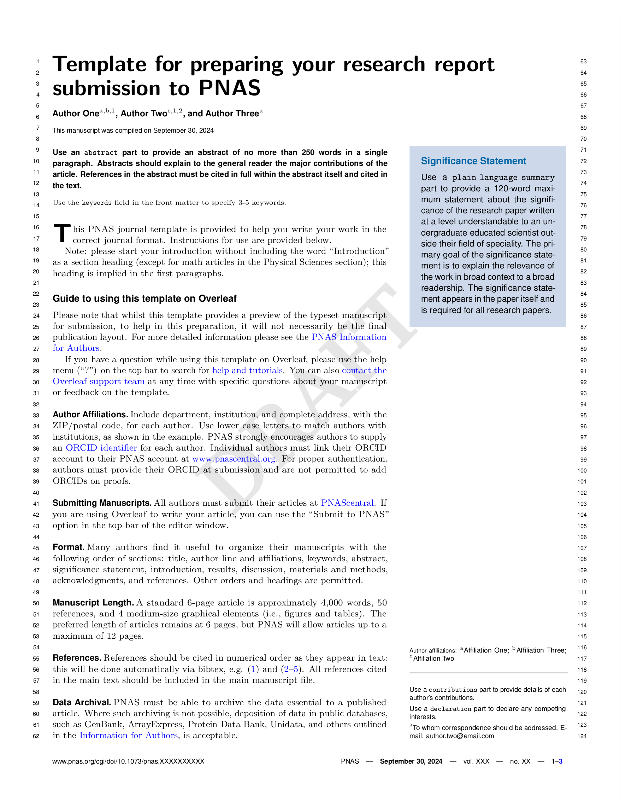

# PNAS research report

Template for preparing a research report submission to PNAS

- Author: Alexandre René (RWTH Aachen)
- Author Website: https://arene.ca
- [Submission Guidelines](https://www.pnas.org/author-center/submitting-your-manuscript)

## Bugs & Todos

* Latex
  - How can we specify to use `pdflatex`? This is what the PNAS template expects.
    + Calling `myst build --pdf` uses XeTeX, which does not correctly format
      the headings. (They are inlined and formatted like normal text.)
  - Whatever generates `main.bib` does not preserve the formatting exactly.
    In the template’s example, `&` is escaped in the source bib but not in the
    exported `main.bib`. This breaks compilation with `pdflatex`.
  - Add an option for displaying line numbers.  
    (The PNAS documents a lineno option, but it doesn’t seem to do anything
    + and everything related in the .cls file is commented out…)
  - The `.sty` files for two template types are missing (`pnasmathematics` and `pnasinvited`).

* Layout
  - The column on the first page should be wider

* Figures
  - Specify positioning options `[!htbp]`
  - Default positioning should be unspecified
  - Support the `SCFigure` environment
      + Ideally via an option to the figure directive

* Tables
  - Specify positioning options `[!htbp]`
  - Default positioning should be [`t!]`
  - Default format should just use `{lrc}`, no `dimexpr`
  - Use `\caption` instead of `\caption*`
    + `\caption*` is not even plain LaTeX2e, so likely to not play well with at least some journal classes. (It’s usually provided by either the caption or longtables package.)
  - Use `\midrule` instead of `\hline`
    (The PNAS class imports booktabs.)
  - Support `\addtabletext` for adding text below tables.

* Equations
  - Support wide (2 column) equations by wrapping them with `{figure*}`
    + This should support positioning, with default `[bt!]`
  - Support `\numberthis` macro in HTML/MathJax export
    + The PNAS class defines this macro to force number an equation item,
      even when in an unnumbered environment. It is used for numbering
      one of many lines in an `align` environment.

* Turn off section numbering
  - Currently this doesn’t even work with `headings: false` in the frontmatter.
    (The inserted commands are still `\section` instead of `\section*`.)
  - Ideally it would be done by default, so that unless the author specifies otherwise, equations/figures/tables are numbered, but not sections. 
  - HACK: In the template I force this with a `.replace` filter on `CONTENT` and `matmethods`, a hyperref error screws up compilation.

* Update the template text so it describes the MyST template rather than the Overleaf one.

* Fix the warning `Label `LastPage' multiply defined.`
  + This seems to be an error in the template: `pnas-new.cls` modifies the `\bibliography` command to also insert this label.

## Limitations

### Other templates

PNAS has separate templates for “Brief Report” and “SI Appendix” which we don’t cover.

### First page
The PNAS template defines a `\firstpage` macro, which must be called _before_ the main text and does some LaTeX voodoo to change the layout commands after a set number of pagraphs. However in my experience this is unreliable: it works on Overleaf, but not when I compile on my local machine. Plus, it makes LaTeX’s errors even more opaque than usual, because it relies on the experimental `\afterpage` package, which moves rendering (and therefore also rendering errors) away from their source.

Instead I defined an `\endfirstpage` macro, which should no be place _after_ the content to go on the first page. This results in less voodoo, more reliable builds, and less confusing errors.

The main limitation is that it currently does not support splitting paragraphs: the first page must end with a paragraph break.

### Multiple subsets of equal contributors
In contrast to the PNAS template, there can be only one group of equal contribution authors. This is due to MyST itself not having a frontmatter syntax for multiple groups.
For example, the PNAS template allows for an author list like

Alfred¹, Beatrice¹, Charlie², Didier²

where authors with the same number are marked as equal contributors.
In the MyST frontmatter, `equal_contributor` is a bool, so at most one set of authors can be specified this way.

Note: The `pnas-new.cls` file also defines an `\equalauthors` macro, where one can provide free-form text which will be displayed in the bottom right of the first page (some location as the author contributions and declaration). This is however undocumented in the `.tex` template, and does not do anything with the provided numbers. Possibly it is a remnant of an old template, and considered superseeded by the `\authorcontributions` macro?

### Conditional fine-grained spacing after the first paragraph

The PNAS template has the following comment above where one would insert the content:

> If your first paragraph […] contains a list environment
> (quote, quotation, theorem, definition, enumerate, itemize...), the line
> after the list may have some extra indentation. If this is the case,
> add \parshape=0 to the end of the list environment.

This template does not provide a mechanism for adding `\parshape=0` at the end of list environments in the first paragraph.

### Duplication of `roles` information

The template does not use the information in each author’s `roles` field.
Instead it requires a separate `author_contributions` part, providing the same
information but as a paragraph with full sentences.

## Other notes

### Fragile source template

The PNAS template is quite fragile: the plain, out-of-the-box template works on Overleaf, but when I download it and compile it locally I get a different output: columns were the wrong width, text the wrong colour. Compiling with XeTeX inlines headings with no visually distinctive style (in contrast to a pdflatex build which formats them in bold as expected).[^why-fragile]

This template makes some changes to the underlying `pnas-new.cls` and `pnasresearcharticle.sty` which should make the output more robust – essentially the class file does very fancy but also fragile things, and where possible we replace  these with jtex’ templating logic which should be more robust. We don’t want to deviate too far from the official template, so as not to cause friction when it comes to ultimately submitting the manuscript, but even within that constraint there is likely room for further improvements on this template’s portability and robustness.

[^why-fragile]: My unverified suspicion is that the provided class file is sensitive to a very specific set of TexLive packages.

## Steps to creating your own template!

- [x] 🆕 Create this repository. Nailed it. 🚀
- [x] 📑 Replace the `template.tex` with your existing LaTeX template/article
- [x] 👯‍♀️ Copy in any other style, definitions or images necessary for the template
- [x] 👩‍🔬 Add the files necessary into `files` list in the `template.yml` ([documentation](https://myst-tools.org/docs/mystjs/jtex/template-yml))
- [x] 🧙‍♀️ Start replacing template values with `[-options.my_value-]` and put in `[# if parts.abstract #]` conditions to toggle sections on and off ([documentation](https://myst-tools.org/docs/mystjs/jtex/template-rules))
- [x] 👩🏿‍💻 Install [jtex](https://myst-tools.org/docs/mystjs/jtex) (`npm install -g jtex`) and run `jtex check` ([documentation](https://myst-tools.org/docs/mystjs/jtex/command-line))
- [x] 🪄 Continue to improve the options in your template for `parts` and `options` ([documentation](https://myst-tools.org/docs/mystjs/jtex/document))
- [x] 💾 When ready, save your `template.yml` and run `jtex check --fix`, this will add various packages that are auto detected and fix document options ([documentation](https://myst-tools.org/docs/mystjs/jtex/command-line))
- [x] 🧪 Test with real content: `myst build my-document.md --template ../path/to/template` ([documentation](https://myst-tools.org/docs/mystjs/guide/creating-pdf-documents))
- [x] 📸 Create a `thumbnail.png` with an accurate screenshot of the template
- [x] 🧭 Update this README, and check all values in the `template.yml`
- [x] 🚀 Push to GitHub, and contribute to the [community templates repository](https://github.com/myst-templates/templates)
